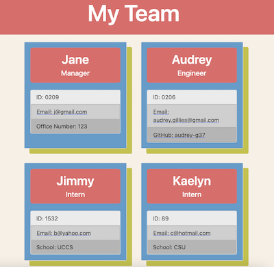

# Team Profile Generator 

## Description

The purpose of this app is to create an html file with each employee's information. This app prompts the user with questions in the command line and then writes the index.html file (in the dist directory) based on the user's input. The content of the index.html file is replaced evertime the app is run.

The first question for the user is about the 'manager'. Then, the user can add an 'intern,' 'engineer,' or choose to not add anymore employees. The user can continue to add interns or engineers repeatedly until they select the third option of not adding anymore employees.

## Table of Contents

- [Installation](#installation)
- [Usage](#usage)
- [Assets](#assets)
- [License](#license)
- [GitHub Profile](#github-profile)
- [Contact by Email](#email)

## Installation

Run npm i to install necessary libraries.

## Usage

Run npm start when you're ready to build your team. Answer each prompt with the exact text you wish to appear on the html file. The index.html will have text content after you select to not add any more employees. The links to the engineers' GitHub profiles will be active and, when clicked, will open the profile in a new tab. All email addresses will have a link which opens the default email app and creates a 'new' email to that address.

## Assets

[Demo Video]()

## License

This project is licensed with MIT.

### GitHub Profile

[My Profile](https://github.com/audrey-g37)

### Email

audrey.gillies@gmail.com
